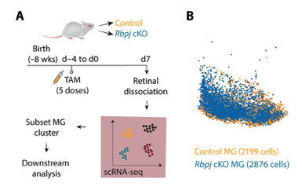

# Introduction

This site is an example of an RShiny Dashboard. The idea is to create a
shareable version of the analysis, that collaborators can explore the
data with.

This is something I could produce with internal or external data for
labs.

# Data/Paper Summary

<figure>

<figcaption aria-hidden="true">image</figcaption>
</figure>

I demonstrate this with previous published data
([GEO](https://www.ncbi.nlm.nih.gov/geo/query/acc.cgi?acc=GSE246574)
from the Hoang Lab. The title of the publication is: **Robust
reprogramming of glia into neurons by inhibition of Notch signaling and
nuclear factor I (NFI) factors in adult mammalian retina** and is
available online
([link](https://www.science.org/doi/10.1126/sciadv.adn2091)).

Data Overview:

-   Retinal samples from adult mice
-   More notes, etc.

Data processing:

-   Notes…

# **Application Guide**

## DimRed Plots

A 2D representation of the transcriptomic profiles of all cells.

### Row One

Showing both the PCA (left) and UMAP (right) projections and colored by
clusters.

### Row Two

Allows the ability to highlight one cluster at a time within both
projections. The highlighted cluster is controlled by the drop down menu.

## Quality Controls

Allowing the visualization of different QC metrics. Metrics are
predefined and are accessed in the drop down menu.

### Row One

Feature plot showing the the level of the QC metric in a UMAP projection
and then as a violin plot.

### Row Two

Reference UMAP plot which has the clusters labeled, to aid in
translation between the two figures in row one.

## Cluster Abundance

Looking at the differences in abundance between conditions across the
clusters.

### Row One

UMAP projection color by condition.

### Row Two

Table showing the number of cells within each cluster by sample or
total. The fill color represents the percentage of the cluster that
belongs to each condition.

Stacked bar plot to visualize the distribution of clusters between the
two conditions.

## Comp. Marker Genes

Marker genes for each cluster were generated from the FindAllMarkers()
function in Seurat using the flag &lt;only.pos = T&gt;. Users have the
ability to choose the cluster of interest, and further delve into the
top 100 markers for each cluster with visualizations.

### Column 1

Table containing the top 100 markers for the target cluster.

-     *Row-name*: gene
-     *avg\_log2FC*: the average log2 fold-change between the target
    cluster and all other clusters
-     *pct.1*: the percentage of cells in the target cluster that
    express the gene
-     *pct.2*: the percentage of cells in all other clusters that
    express the gene
-     *p\_val\_adj*: adjusted p-value for the differential expression
    for the cluster vs all others

### Column 2

Further visualization of target gene.

Cell expression of the target gene in a UMAP projection and a violin
plot (the target cluster is isolated to the left of this plot).

## Gene Expression

An exploratory tool to look at one’s gene of interest. Gene is selected
by the drop down menu. The menu is ordered alphabetically and can also be
filtered by typing in the gene name.

### Row One

Feature plot showing the expression of the target gene in PC and UMAP
plots.

### Row Two

Violin plots of the gene expression. On the left is a violin plot
separated by cluster, and on the right each violin for the left is
further separated into the two different conditions.

## Literature Markers

Allows the visualization of of different marker lists and how they align
with the clusters. This is a predefined spreadsheet, currently
containing four sub-lists (as of 9/17/24). Each marker list is defined by
the region in the eye it is attended for, followed by the origin of the
list. These marker lists can be selected from the first drop down menu.

Once a Marker List has been set, one can further select the cell type of
interest for additional plots.

### Column 1

The first column consists of two figures using the selected marker list
from the drop down menu. The first is a heatmap of the scaled marker set
(y-axis) score for each cluster centroid (x-axis). Clusters were ordered
by hierarchical clustering to group clusters with similar identities.
The highest score for each cluster (column) is then outlined with a
black box.

The second figure relabels the clusters in the UMAP projection with the
highest marker score (outlined in the black boxes) for each cluster.

### Column 2

The first figure shows a violin plot of the marker set scores for the
selected marker list and cell type. Each cell in the data has a score
and the violin plots show the distribution of these scores (y-axis)
across the different clusters (x-axis). Clusters with a high
distribution of scores indicate that perhaps this cluster aligns with
this cell type.

The second figure is a dotplot showing the average expression (color)
and percent expressed (size) of the genes that make up the cell type
markers from the marker list, across the different clusters. This data
aligns with the first figure in this column, but helps distinguish
between the individual contributions of the marker genes to the overall
score.

## Condition DEGs

The data consists of two conditions: WT & MUT. Here we ran differential
expression between these conditions across all the clusters using a
Wilcoxon Rank Sum Test. To further investigate this differential
expression one can use the drop down menu to select the cluster of
interest.

The volcano plot for the selected cluster will appear below. The x-axis
is the average log 2 fold-change between the two conditions (positive
values indicate the expression is higher in the WT and visa versa for
MUT). The y-axis shows the -log10 adjusted p-values indicating the
significance of the fold-change. A black dashed line indicates a
adjusted p-value of 0.05, which is used as a cutoff for significance.
All points below the 0.05 cutoff (aka a higher adjusted p-value than
0.05) are marked as non-significant (N.S.). For most plots the top five
genes (according to smallest adjusted p-values) for both WT and MUT are
labeled.

Genes/points can be selected in the figure with a click of the mouse
mouse. When a point is selected a table populates at the bottom showing
the underlying data frame for this gene. Also a violin plot appears
showing the expression of this gene across all clusters. The violin plot
seperates the selected cluster (via the dropdown menu) to the left of
the figure, and splits the expression within the cluster between the two
conditions.
